<p align="center">
  
  
  
  
  
</p>

# 🛡️ Adaptive Cyber-Physical Security

> **An adaptive multi-tier hybrid intrusion detection system for zero-day threat generalization, evaluated on the CIC-IDS-2018 benchmark (8.2 M network flows, 13 attack families).**

---

## 🧠 Core Idea

Traditional intrusion detection systems fail in **open-world** environments: supervised classifiers achieve perfect precision on known attack signatures but provide **zero recall** against novel (zero-day) threats. This project builds a **multi-tier adaptive defense** that fuses discriminative classification with deep anomaly detection and learned latent-space representations, delivering high-confidence known-attack identification **and** meaningful zero-day coverage.

---

## 🏗️ System Architecture

### Pipeline Overview

<p align="center">
  
</p>

### Hybrid Models (Phase 3)

```
  Hybrid 1 │ Standard AE + OC-SVM      (bottleneck space)
  Hybrid 2 │ Standard AE + Isolation Forest  (bottleneck)
  Hybrid 3 │ Standard AE + RF Pseudo-label   (raw 68-dim)
  Hybrid 4 │ Sparse AE   + OC-SVM      (bottleneck space)
  Hybrid 5 │ Denoising AE + OC-SVM     (bottleneck space)
  Hybrid 6 │ Meta-Ensemble: avg of all 8 normalized scores
```

---

## 📊 Results at a Glance

### Phase 1 → Phase 2 → Phase 3 Progression

| Model | Phase | ROC-AUC | Precision | Recall | F1 | Zero-Day Recall |
|:------|:-----:|:-------:|:---------:|:------:|:--:|:---------------:|
| Random Forest | 1 | — | 1.000 | 0.178 | 0.303 | **0.000** ❌ |
| One-Class SVM | 1 | — | 0.907 | 0.145 | 0.249 | 0.145 |
| Random Forest | 2 | — | 1.000 | 0.130 | 0.240 | **~0.000** ❌ |
| Autoencoder (baseline) | 2 | 0.8965 | 0.501 | 0.017 | 0.034 | 0.017 |
| **Denoising AE alone** | **3** | **0.8867** | **0.818** | **0.079** | **0.143** | **0.079** ✅ |
| Hybrid 3: AE + RF | 3 | 0.7920 | 0.498 | 0.017 | 0.034 | 0.017 |
| Meta-Ensemble (H6) | 3 | 0.4140 | 0.220 | 0.005 | 0.010 | 0.005 |

### Phase 3 Full Model Comparison (P99 Threshold)

| Model | ROC-AUC | Avg Prec. | F1 | Recall | Precision |
|:------|:-------:|:---------:|:--:|:------:|:---------:|
| Baseline: Standard AE | 0.8965 | 0.7578 | 0.0336 | 0.0174 | 0.5012 |
| Hybrid 1: AE + OC-SVM | 0.4600 | 0.3137 | 0.0094 | 0.0048 | 0.2127 |
| Hybrid 2: AE + Iso.Forest | 0.4231 | 0.3392 | 0.0116 | 0.0060 | 0.2508 |
| Hybrid 3: AE + RF (pseudo) | 0.7920 | 0.5593 | 0.0335 | 0.0174 | 0.4976 |
| Ref: Sparse AE alone | 0.8929 | 0.7597 | 0.0336 | 0.0174 | 0.4986 |
| Hybrid 4: Sparse AE + OC-SVM | 0.4206 | 0.3007 | 0.0190 | 0.0098 | 0.3561 |
| **Ref: Denoising AE alone** | **0.8867** | **0.7675** | **0.1433** | **0.0785** | **0.8179** |
| Hybrid 5: DAE + OC-SVM | 0.4783 | 0.3186 | 0.0057 | 0.0029 | 0.1398 |
| Hybrid 6: Meta-Ensemble | 0.4140 | 0.3024 | 0.0098 | 0.0050 | 0.2202 |

> **Key Takeaway (Phase 3):** Standalone AE variants consistently outperform their hybrid counterparts. The **Denoising AE** achieves the best per-threshold F1 (0.1433) and precision (0.8179). Boundary models (OC-SVM, IF) in the 32-dim bottleneck space fail to separate latent distributions, degrading hybrid ROC-AUC below 0.50. **Representation quality is the bottleneck.**

### 🔬 Ablation Studies

To isolate the contribution of each design decision, we systematically compare configurations:
1. **AE representation vs. raw features**: The pseudo-label RF trained on AE pseudo-labels improves by **+131%** over the RF trained on raw features with random labels, confirming the AE's soft pseudo-labels inject meaningful structure.
2. **Denoising regularization**: Switching from Standard AE to Denoising AE raises F1 by **+327%** and precision by **+63%** at the same P99 threshold. This noise-corruption training is the *most impactful individual component*.
3. **Adding a boundary model in bottleneck space**: Coupling any AE with OC-SVM or IF degrades ROC-AUC by 0.42–0.47 points relative to the standalone AE. These boundary models contribute *negatively*.
4. **Meta-Ensemble aggregation**: Pooling all eight scores with equal weight performs worse than the worst individual AE. *Score quality*, not quantity, determines ensemble performance.

---

## 📁 Project Structure

```
Adaptive_Cyber_Physical_Security/
│
├── 📂 pipeline/
│   ├── full_preprocessing.py             # Full pipeline: raw CSV → processed dataset
│   └── preprocessing.py                  # Lightweight notebook utility
│
├── 📂 experiments/
│   ├── 📂 eda/
│   │   └── eda_cic18.ipynb               # Exploratory data analysis
│   ├── 📂 feature_engineering/
│   │   └── fe_cic18.ipynb                # Feature selection & engineering
│   └── 📂 models/
│       ├── rf_model.ipynb                # Random Forest (zero-day split) [Phase 1]
│       ├── ocsvm_model.ipynb             # One-Class SVM (benign-only)   [Phase 1]
│       ├── hybrid_model.py               # Hybrid RF + OCSVM (OR-fusion) [Phase 1]
│       ├── autoencoder_model.ipynb       # Deep Autoencoder              [Phase 2]
│       └── final_hybrid_model.ipynb      # Hybrid AE + boundary models   [Phase 3] ⭐
│
├── 📂 data/
│   ├── 📂 raw/                           # Raw CIC-IDS-2018 daily CSVs
│   └── 📂 processed/
│       ├── cic18_full_processed.csv      # Main modeling file (8.2M × 52)
│       └── clean_features.csv            # Notebook FE artifact
│
├── 📂 outputs/plots/
│   ├── 📂 eda/                           # Label distribution, histograms, heatmaps
│   ├── 📂 feature_engineering/           # Post-cleaning distributions & correlations
│   └── 📂 models/
│       ├── 📂 rf_output/                 # RF curves and confusion matrix
│       ├── 📂 ocsvm_output/              # OCSVM curves, scores, and matrix
│       ├── 📂 autoencoder_output/        # AE: ROC, PR, threshold, per-attack
│       └── 📂 hybird_output/             # Phase 3 hybrid & ensemble plots ⭐
│
├── comparison.html                       # Interactive model comparison report
│
├── 📂 docs/
│   ├── literature_review.md
│   ├── data_dictionary.md
│   ├── data_preprocessing_plan.md
│   └── theoretical_rigor.md
│
├── 📂 report/
│   ├── Phase1_report.pdf
│   ├── Phase_2_report.pdf
│   ├── phase2_main.tex                   # Phase 2 LaTeX source
│   ├── phase2_references.bib             # Phase 2 bibliography
│   ├── phase3_main.tex                   # Phase 3 LaTeX source ⭐
│   └── phase3_references.bib             # Phase 3 bibliography ⭐
│
├── 📂 presentation/
│   ├── index.html
│   ├── presentation.html
│   └── index.pdf
│
├── 📂 references/                        # Reference papers (PDFs)
├── requirements.txt
└── README.md
```

---

## 🚀 Quick Start

### Prerequisites

- Python 3.11+  |  ~16 GB RAM  |  AWS t3.large or equivalent recommended
- Raw CIC-IDS-2018 CSV files ([download here](https://www.unb.ca/cic/datasets/ids-2018.html))

### Installation

```bash
git clone <repo-url>
cd Adaptive_Cyber_Physical_Security
pip install -r requirements.txt
```

### Step 1 — Preprocess

```bash
python pipeline/full_preprocessing.py
# → data/processed/cic18_full_processed.csv  (8.2M rows × 52 columns)
```

### Step 2 — EDA & Feature Engineering

```bash
jupyter notebook experiments/eda/eda_cic18.ipynb
jupyter notebook experiments/feature_engineering/fe_cic18.ipynb
```

### Step 3 — Phase 1 & 2 Models

```bash
jupyter notebook experiments/models/rf_model.ipynb           # Random Forest
jupyter notebook experiments/models/ocsvm_model.ipynb        # One-Class SVM
jupyter notebook experiments/models/autoencoder_model.ipynb  # Autoencoder
```

### Step 4 — Phase 3 Hybrid Models ⭐

```bash
jupyter notebook experiments/models/final_hybrid_model.ipynb
# Runs all 6 hybrid configurations + Meta-Ensemble
# Saves 7 comparison plots to outputs/plots/models/hybird_output/
```

---

## 🔬 Models in Depth

### Tier 1 — Random Forest (Supervised Baseline)

| Property | Value |
|:---------|:------|
| **Type** | Supervised ensemble classifier |
| **Estimators** | 100 bagged decision trees |
| **Training data** | Benign + 1 seen attack (`dos attacks-hulk`) |
| **Strength** | Perfect precision (1.000) on known threats |
| **Weakness** | Zero zero-day recall |

### Tier 2 — One-Class SVM (Kernel Anomaly Detector)

| Property | Value |
|:---------|:------|
| **Type** | Semi-supervised anomaly detection |
| **Kernel** | RBF, γ = `scale`, ν = 0.05 |
| **Training data** | 20,000 benign samples |
| **Strength** | Non-zero zero-day recall |

### Tier 3 — Autoencoder Variants (Deep Anomaly Detector)

| Property | Standard AE | Sparse AE | Denoising AE |
|:---------|:-----------:|:---------:|:------------:|
| **Architecture** | 68→128→64→**32**→64→128→68 | Same + L1 reg. | Same + GaussianNoise |
| **Loss** | MSE | MSE + L1 | MSE |
| **Special** | Baseline | λ=1e-4 bottleneck | σ=0.1 input noise |
| **ROC-AUC** | 0.8965 | 0.8929 | 0.8867 |
| **F1 @ P99** | 0.0336 | 0.0336 | **0.1433** |
| **Precision @ P99** | 0.501 | 0.499 | **0.818** |

### Phase 3 — Hybrid Configurations

| Hybrid | Boundary Model | Feature Space | ROC-AUC |
|:-------|:--------------|:-------------|:-------:|
| Hybrid 1 | OC-SVM | AE bottleneck (32-dim) | 0.4600 |
| Hybrid 2 | Isolation Forest | AE bottleneck (32-dim) | 0.4231 |
| Hybrid 3 | RF Pseudo-label | Original (68-dim) | 0.7920 |
| Hybrid 4 | OC-SVM | Sparse AE bottleneck | 0.4206 |
| Hybrid 5 | OC-SVM | DAE bottleneck | 0.4783 |
| **Hybrid 6** | **Meta-Ensemble** | **All 8 scores (avg)** | **0.4140** |

> **Finding:** OC-SVM and IF fail to separate latent distributions in the 32-dim bottleneck space, consistently degrading AUC below 0.50. Hybrid 3 (RF in 68-dim space) maintains competitive AUC (0.7920) but is limited by sparse pseudo-labels.

### 💡 Hybrid Innovation

The Deep Learning model significantly and logically improves upon the ML baseline. The interaction is symbiotic, creating a system where the whole is greater than the sum of its parts:
* **DL Improvement Over ML Baseline**: The Denoising Autoencoder raises the per-threshold F1 by +327% and precision by +63% over the standard AE baseline, maintaining a ROC-AUC of 0.8867—a level no classical ML model in this study approaches.
* **Symbiotic Neuro-Symbolic Coupling**: The neural component (AE) generates soft pseudo-labels that encode its probabilistic view of anomalies. The symbolic component (RF) then learns an interpretable decision boundary in the original feature space.
* **Differentiable Anomaly Scoring**: Unlike hard-threshold classifiers, the AE's mean-squared reconstruction error is a differentiable, continuous anomaly score.

---

## 📈 Generated Visualizations

### EDA
| Plot | File |
|:-----|:-----|
| Class distribution | `outputs/plots/eda/label_distribution.png` |
| Feature histograms | `outputs/plots/eda/feature_histograms.png` |
| Correlation heatmap | `outputs/plots/eda/correlation_heatmap.png` |

### Autoencoder (Phase 2)
| Plot | File |
|:-----|:-----|
| Training history | `outputs/plots/models/autoencoder_output/plot_training_history.png` |
| Error histogram | `outputs/plots/models/autoencoder_output/plot_error_histogram.png` |
| ROC curve | `outputs/plots/models/autoencoder_output/plot_roc_curve.png` |
| Precision-Recall | `outputs/plots/models/autoencoder_output/plot_pr_curve.png` |
| Threshold sensitivity | `outputs/plots/models/autoencoder_output/plot_threshold_sensitivity.png` |
| Per-attack detection | `outputs/plots/models/autoencoder_output/plot_per_attack_detection.png` |

### Phase 3 Hybrid & Ensemble ⭐
| Plot | File |
|:-----|:-----|
| ROC curves (all models) | `outputs/plots/models/hybird_output/plot_roc_all_models.png` |
| Precision-Recall (all) | `outputs/plots/models/hybird_output/plot_pr_all_models.png` |
| Metric bar comparison | `outputs/plots/models/hybird_output/plot_metric_comparison.png` |
| Meta-Ensemble confusion matrix | `outputs/plots/models/hybird_output/plot_confusion_matrix_ensemble.png` |
| Per-attack: Hybrid vs AE | `outputs/plots/models/hybird_output/plot_per_attack_hybrid_vs_ae.png` |
| Threshold sensitivity (hybrid) | `outputs/plots/models/hybird_output/plot_threshold_sensitivity_hybrid.png` |
| RF feature importance | `outputs/plots/models/hybird_output/plot_rf_feature_importance.png` |

---

## 🔁 Reproducibility

This project features a fully reproducible pipeline:
* **Environment**: Setup via the provided `requirements.txt` script (tested on AWS EC2 `t3.large`, Ubuntu 24.04, Python 3.12).
* **Caching Pipeline**: Every expensive computation is cached to disk after its first run, making the pipeline fully re-entrant (`FORCE_RERUN` flag available).
* **Determinism**: All random number generators are seeded (`SEED = 42`) across NumPy, TensorFlow, and scikit-learn.
* **Standard Formatting**: The report follows standard IEEE two-column conference paper formatting.

---

## 📄 Reports & Deliverables

| Deliverable | Location | Notes |
|:------------|:---------|:------|
| Phase 1 Report (PDF) | `report/Phase1_report.pdf` | IEEE-format |
| Phase 2 Report (PDF) | `report/Phase_2_report.pdf` | IEEE-format |
| Phase 2 LaTeX | `report/phase2_main.tex` | + `phase2_references.bib` |
| **Phase 3 LaTeX** ⭐ | `report/phase3_main.tex` | + `phase3_references.bib` |
| Model Comparison | `comparison.html` | Open in browser |
| Interactive Presentation | `presentation/index.html` | Open in browser |

### Compiling Reports

```bash
cd report

# Phase 2
pdflatex phase2_main.tex && bibtex phase2_main && pdflatex phase2_main.tex && pdflatex phase2_main.tex

# Phase 3 (Requires Inkscape for SVG conversion)
pdflatex --shell-escape phase3_main.tex && bibtex phase3_main && pdflatex --shell-escape phase3_main.tex && pdflatex --shell-escape phase3_main.tex
```

---

## 🧪 Evaluation Metrics

| Metric | Definition | Why It Matters |
|:-------|:-----------|:---------------|
| Accuracy | (TP+TN) / Total | Overall correctness |
| Precision | TP / (TP+FP) | Flagged attacks that are real |
| Recall | TP / (TP+FN) | Real attacks caught |
| F1-Score | Harmonic mean of P & R | Balanced measure |
| **Zero-Day Recall** | TP_unseen / Total_unseen | **Core metric** |
| ROC-AUC | Area under ROC curve | Threshold-free discriminative power |
| PR-AUC | Area under PR curve | Performance under class imbalance |

---

## 📚 Documentation

| Document | Description |
|:---------|:------------|
| [`docs/literature_review.md`](docs/literature_review.md) | 7-section survey: IDS evolution, ML in cybersecurity |
| [`docs/data_dictionary.md`](docs/data_dictionary.md) | Full column-level dictionary |
| [`docs/data_preprocessing_plan.md`](docs/data_preprocessing_plan.md) | Preprocessing strategy |
| [`docs/theoretical_rigor.md`](docs/theoretical_rigor.md) | Mathematical justification |

---

## 🗃️ Dataset

**[CIC-IDS-2018](https://www.unb.ca/cic/datasets/ids-2018.html)** — Canadian Institute for Cybersecurity

| Property | Value |
|:---------|:------|
| Total flows (raw) | 8,284,195 |
| Flows used (Phase 3) | 3,215,110 |
| Feature columns | 68 (after pruning) |
| Benign traffic | 2,050,783 (63.8%) |
| Attack traffic | 1,164,327 (36.2%) |
| Attack families | 13 |
| Preprocessing | ID removal → coercion → imputation → constant drop → corr. prune (ρ > 0.98) → RobustScaler |

---

## 👥 Authors

| Name | Email | Institution |
|:-----|:------|:------------|
| **Pugazhendhi J** | pugazhendhi.j23csai@nst.rishihood.edu.in | Dept. of CS & AI, Rishihood University |
| **Dally R** | dally.r23csai@nst.rishihood.edu.in | Dept. of CS & AI, Rishihood University |

---

## 📖 Key References

1. Sharafaldin, I., et al. "Toward Generating a New Intrusion Detection Dataset." *ICISSP*, 2018.
2. Breiman, L. "Random Forests." *Machine Learning*, 45(1), 2001.
3. Schölkopf, B., et al. "Estimating the Support of a High-Dimensional Distribution." *Neural Computation*, 2001.
4. Vincent, P., et al. "Stacked Denoising Autoencoders." *JMLR*, 2010.
5. Liu, F.T., et al. "Isolation Forest." *ICDM*, 2008.
6. Chandola, V., et al. "Anomaly Detection: A Survey." *ACM Computing Surveys*, 2009.
7. Dietterich, T.G. "Ensemble Methods in Machine Learning." *LNCS*, 2000.
8. Almalawi, A., et al. "An IDS to Detect Zero-Day Attacks Using ML." *PLOS ONE*, 2024.

---

<p align="center">
  <strong>Phase 1:</strong> EDA · Feature Engineering · RF · OC-SVM &nbsp;&nbsp;│&nbsp;&nbsp;
  <strong>Phase 2:</strong> Autoencoder · Hybrid Fusion · Full-Scale Evaluation &nbsp;&nbsp;│&nbsp;&nbsp;
  <strong>Phase 3:</strong> Learned Representations · Hybrid AE Models · Meta-Ensemble
</p>
